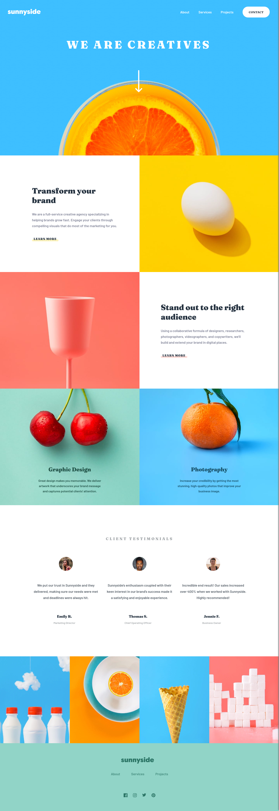

# Frontend Mentor - Sunnyside agency landing page solution

This is a solution to the [Sunnyside agency landing page challenge on Frontend Mentor](https://www.frontendmentor.io/challenges/sunnyside-agency-landing-page-7yVs3B6ef). Frontend Mentor challenges help you improve your coding skills by building realistic projects.

## Table of contents

- [Overview](#overview)
  - [The challenge](#the-challenge)
  - [Screenshot](#screenshot)
  - [Links](#links)
- [My process](#my-process)
  - [Built with](#built-with)
  - [Useful resources](#useful-resources)
- [Author](#author)

## Overview

### The challenge

Users should be able to:

- View the optimal layout for the site depending on their device's screen size
- See hover states for all interactive elements on the page

### Screenshot

### Links

- Solution URL: [GitHub](https://github.com/GrzywN/sunnyside-agency-landing-page-main)
- Live Site URL: [Netlify](https://elegant-platypus-6faefc.netlify.app/)

## My process

### Built with

- Mobile-first workflow
- Semantic HTML5 markup
- CSS3 with SCSS preprocessor
- Flexbox / CSS Grid
- 7-1 Sass architecture
- CSS animations and transitions
- JavaScript (ES6+)
- GSAP and ScrollTrigger animations for Desktop
- Parcel

### Useful resources

- [Stop using @import with Sass | @use and @forward explained](https://youtu.be/CR-a8upNjJ0) - This video helped me to change my `@import` for `@use` and `@forward` in my Sass/SCSS.
- [How To Create Advanced CSS Dropdown Menus](https://youtu.be/S-VeYcOCFZw) - This helped me a lot with closing navbar for mobile, when the user clicked outside of menu.

## Author

- Frontend Mentor - [@grzywn](https://www.frontendmentor.io/profile/grzywn)
- Twitter - [@grzywn](https://www.twitter.com/grzywn)
